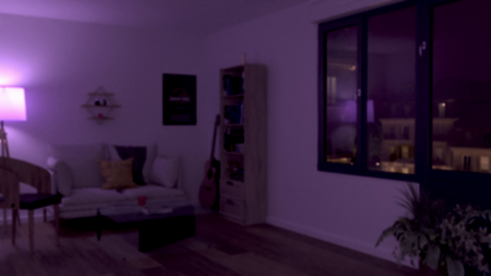

# Décor Virtuel - Crédits

## Modèles

- [Bookcase 38 : saeedyamini](https://3dsky.org/3dmodels/show/bookcase_38)
- [Baton Rouge Guitar : Sa1id](https://3dsky.org/3dmodels/show/baton_rouge_guitar)
- [Fujifilm X100V : NghiLe](https://www.cgtrader.com/free-3d-models/electronics/video/fujifilm-x100v)
- [Couch Williams 302 : alexis16715](https://www.cgtrader.com/free-3d-models/furniture/sofa/couch-williams-302)
- [Chair Realistic : Studio Delusion](https://www.turbosquid.com/3d-models/chair-realistic-3d-1683166)
- [3D Diamond Cross Planes Shelf : Designconnected](https://www.turbosquid.com/3d-models/3d-diamond-cross-planes-shelf-1172679)
- [Torsher Calvin : Oleg&Vlad](https://3dsky.org/3dmodels/show/torsher_calvin)
- [Zhurnaly : nudoestudio](https://3dsky.org/3dmodels/show/zhurnaly)
- [Plane Coffee Table : Designconnected](https://www.turbosquid.com/3d-models/plane-coffee-table-3d-model-1308560)
- [Corporate Set of Vase : createlabcgi](https://www.cgtrader.com/free-3d-models/plant/pot-plant/corporate-set-of-vase)
- [Okno : juliyacezar](https://3dsky.org/3dmodels/show/okno)
- [Ulichnogo Fonaria : umathurman](https://3dsky.org/3dmodels/show/3d_model_ulichnogo_fonaria)
- [Haussmanian Parisian Building : arnokok](https://3dsky.org/3dmodels/show/haussmanian_parisian_building)
- [Pin Chherry : 3Design.FB](https://3dsky.org/3dmodels/show/pin_chherry)

Et quelques modèles que j'ai faits moi-même.

## Textures

### Général

- [CC0 Textures / Ambient CG](https://ambientcg.com/)
- [Polyhaven](https://polyhaven.com/)
- [Textures.com](https://www.textures.com/)

### Très spécifique

- [Jurassic Park Poster](https://www.europosters.fr/affiches-et-posters/jurassic-park-v56560)

## Logiciels

- [Blender](https://www.blender.org/)
- [Blackmagic Fusion](https://www.blackmagicdesign.com/fr/products/fusion/)
